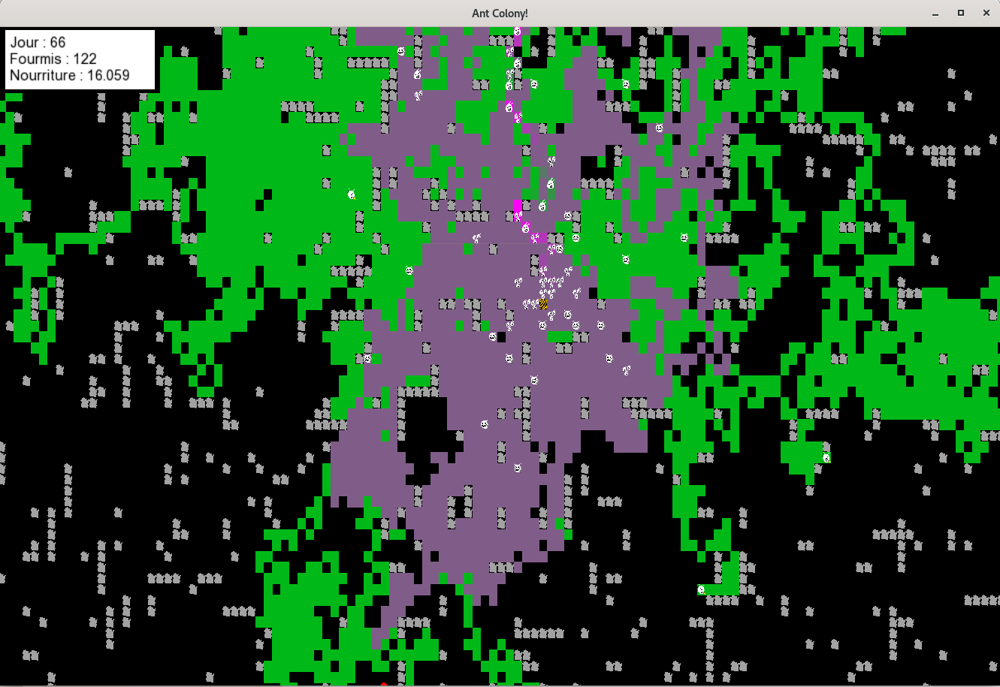

# ant-colony

This school project realised with @LotharieSlayer simulates the life of an ant colony. 




#### Requirements
- [SFML](https://www.sfml-dev.org/)
- CMake 3.26 minimum

### Potential errors
#### GLIBC Error
You can get the following (or similar) error message on linux:
```
/usr/bin/ld: CMakeFiles/ant_colony.dir/app/main.cpp.o: référence au symbole non défini « pthread_create@@GLIBC_2.2.5 »
/usr/bin/ld : /lib/x86_64-linux-gnu/libpthread.so.0 : erreur lors de l'ajout de symboles : DSO manquant dans la ligne de commande
collect2: error: ld returned 1 exit status
make[2]: *** [CMakeFiles/ant_colony.dir/build.make:276 : ant_colony] Erreur 1
make[1]: *** [CMakeFiles/Makefile2:83 : CMakeFiles/ant_colony.dir/all] Erreur 2
make: *** [Makefile:91 : all] Erreur 2
```

To solve this, you need to add the following line to the `CMakeLists.txt` file:  
`SET(CMAKE_CXX_FLAGS "${CMAKE_CXX_FLAGS} -pthread")`
